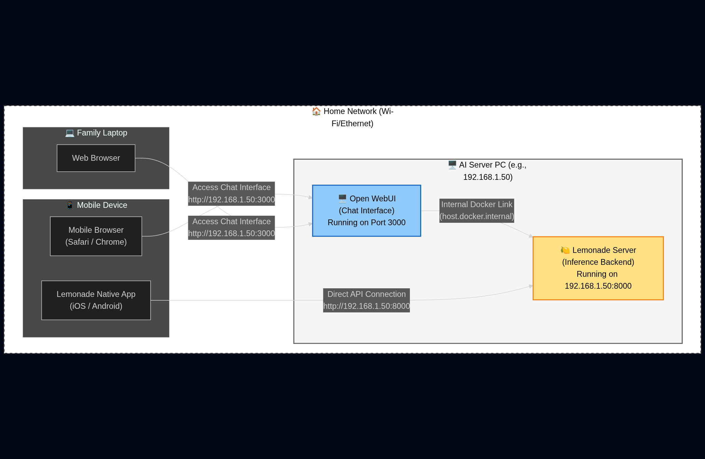
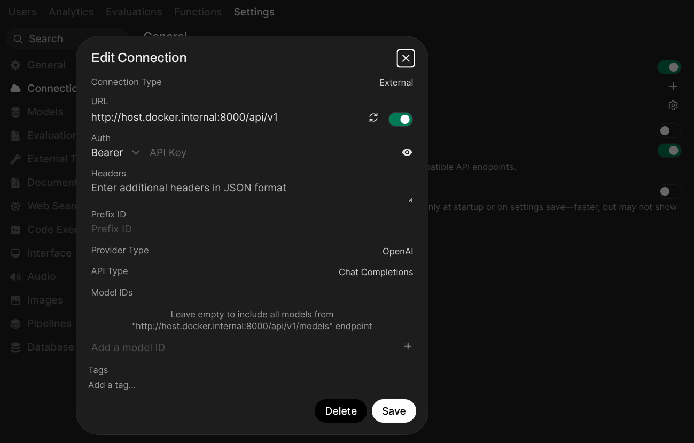
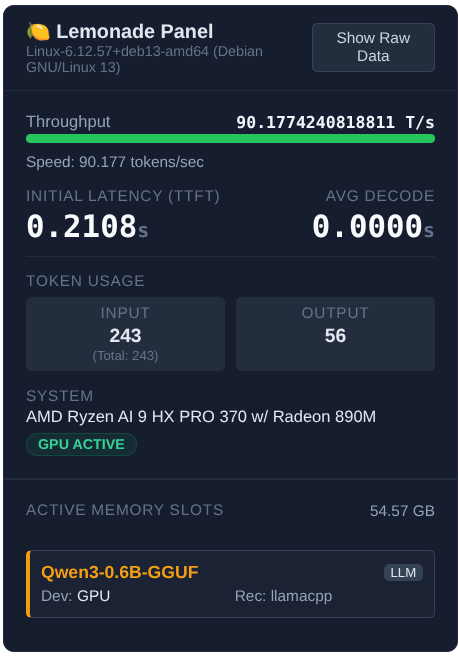
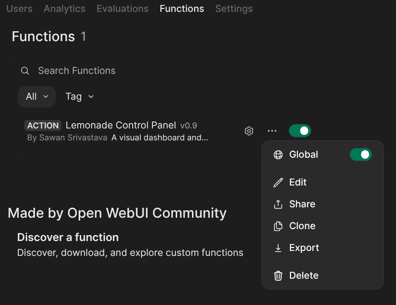
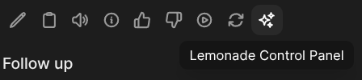

It's not a big secret that AI Labs train their foundational models on your personal chat sessions. While they strip PII (Personally Identifiable Information), your habits and curiosities ultimately become weights in a matrix somewhere in a data center.

Beyond the privacy aspect, there is ecosystem fragmentation. If you want to run local AI, you usually need Ollama for text, Automatic1111 for images, and something else for voice. You end up managing three different services and fighting port conflicts/pesky endpoint setup.

For my LAN setup, I wanted a **single, unified stack** that offers:

- **Total Privacy:** No data leaves my house.
- **Multimodality:** Text, Image Gen, and Voice in one interface.
- **Family Access:** Accessible from any phone or laptop in the house.

## Here is how I built it using **Lemonade**, **Open WebUI**, and **Lemonade Control Panel** (an Open WebUI plugin) to tie it all together.

### Step 1: The Backend (Lemonade)

Lemonade is the inference engine. It's unique because it supports LLMs, Stable Diffusion, and Whisper (voice) out of the box, optimized for NPUs (like the Ryzen AI series) and GPUs. It recently added full Ollama endpoint compatibility, which makes it incredibly flexible.

To make this work house-wide, we can't just run it on `localhost`. We need to bind it to all network interfaces so other devices can see it.

**The Setup:**

1.  Install Lemonade (via the installer or CLI).
2.  Run the server with the host flag set to `0.0.0.0`:

    lemonade-server serve --host 0.0.0.0 --port 8000

**Note:** On Windows, you may get a firewall prompt. Make sure to allow access for Private Networks so your phone can talk to your PC.

### Step 2: The Frontend (Open WebUI)

Open WebUI is the best interface out there. It looks and feels exactly like ChatGPT, supports user accounts, and handles history beautifully.

While Open WebUI supports various installation methods, including Python `uv`, building from source, and Kubernetes Helm charts, we will use **Docker** for this guide as it's the cleanest way to get started without polluting your system dependencies.

    docker run -d -p 3000:8080 --add-host=host.docker.internal:host-gateway -v open-webui:/app/backend/data --name open-webui ghcr.io/open-webui/open-webui:main

Once running at `http://localhost:3000`, you need to connect it to Lemonade. Recently, Lemonade added support for the **Ollama API** as an alternative to the standard OpenAI-compatible endpoint. This gives you two distinct ways to configure your backend.

#### Option A: The Ollama Connection (Recommended for Management)

Since Open WebUI supports the Ollama API natively, and Lemonade now supports it too, you can connect them to unlock full model management features.

By selecting this option, you can use the native **Settings \> Models** interface in Open WebUI to search, pull, and delete models installed on your Lemonade server just like you would with a standard Ollama instance.

1.  Go to **Settings \> Admin Settings \> Connections \> Ollama**.
2.  Set the Ollama API URL to `http://host.docker.internal:11434`.

#### Option B: The OpenAI Connection

Alternatively, you can use the standard OpenAI-compatible endpoint. This is robust for chat and image generation, but it lacks the native "Model Management" UI described above.

1.  Go to **Settings \> Admin Settings \> Connections \> OpenAI**.
2.  Set the OpenAI API URL to `http://host.docker.internal:8000/api/v1`.

#### Setting up Image Generation

Since the Lemonade backend is multimodal, you don't need a separate Stable Diffusion server! You can simply point Open WebUI's image settings to the Lemonade endpoint.

For specific instructions on connecting the image generation feature, refer to the [official documentation here](https://lemonade-server.ai/docs/server/apps/open-webui/#image-generation).

### Step 3: The Lemonade Control Panel Plugin

Regardless of which API connection you chose in Step 2, standard Open WebUI doesn't show you low-level system stats. I wanted a telemetry snapshot to see exactly how my hardware was performing.

I wrote a plugin called **Lemonade Control Panel**. It provides a visual **snapshot view** of your server's health, including system info, RAM health and Token/Sec speeds.

**Universal Compatibility:** You can use this plugin with *either* API option.

However, if you chose the **OpenAI Connection (Option B)**, this plugin is especially useful. Since that API option lacks native model management in the UI, this plugin enables `pull` and `delete` commands directly within the chat window.

To install it, go to [the plugin's community page](https://openwebui.com/posts/lemonade_control_panel_a5ee89f2), click on "Get", then on "Save". After you have successfully imported the plugin, be sure to enable it in the "Functions" setting.

Now that you've installed the plugin, you are ready to start using it! Open a new chat session and look for the "Lemonade Control Panel" button.

### Step 4: Going House-Wide

Now that the server is up and running on `0.0.0.0`, you have two great options for accessing this from your phone or tablet.

First, you need to find your server's Local IP Address (e.g., `192.168.1.50`).

#### Option A: The Native App Experience (Recommended)

If you prefer a native feel, you can use the official Lemonade apps. They connect directly to the backend, skipping Open WebUI entirely while still giving you access to all the models you've pulled.

1.  Download the **Lemonade** app for iOS or Android.
2.  In the settings, set the endpoint to: `http://YOUR_LOCAL_IP:8000`
3.  Start chatting.

### Option B: Open WebUI on Mobile

If you want the full experience, including user history, the admin dashboard, and image generation settings, use the browser.

1.  Open Chrome/Safari on your phone.
2.  Navigate to: `http://YOUR_LOCAL_IP:3000`
3.  **Tip:** Use "Add to Home Screen" on iOS to make it look like a full app.

**Firewall Check:** If your phone can't connect, check the Windows Firewall (or `ufw` on Linux) on your server PC. You need to allow inbound traffic on ports **8000** (for the App) and **3000** (for WebUI).

And that's it! You now have a private, powerful AI cloud running entirely locally.

---

### Documentation & Resources

If you want to dive deeper into advanced configurations, check out the official docs:

- [Lemonade Server Documentation](https://lemonade-server.ai/docs/)
- [Open WebUI Documentation](https://docs.openwebui.com/)
