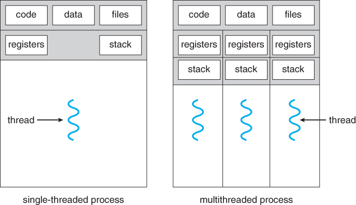
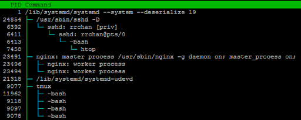
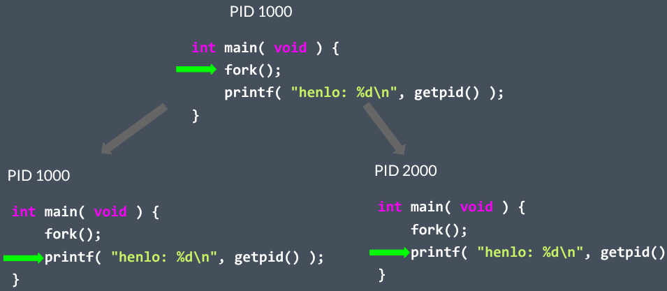
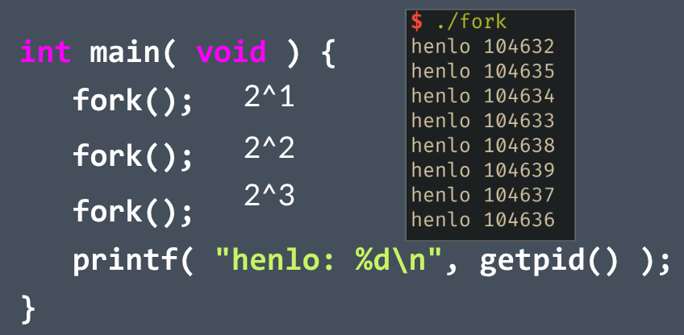
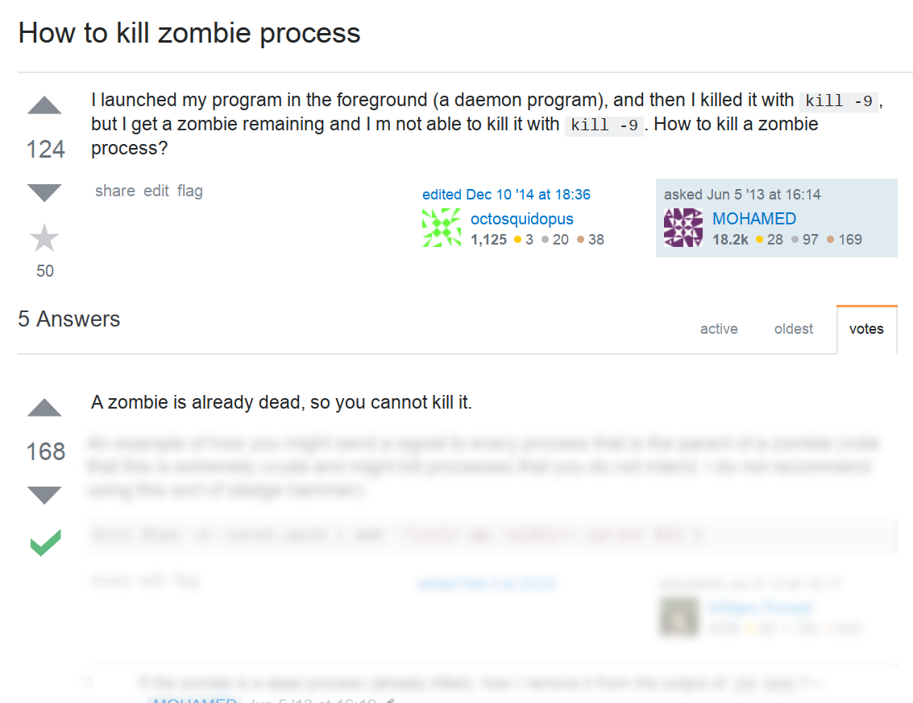
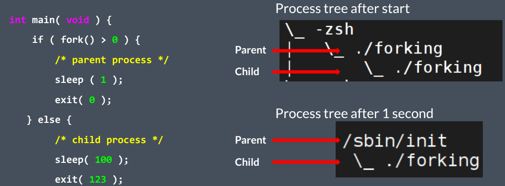
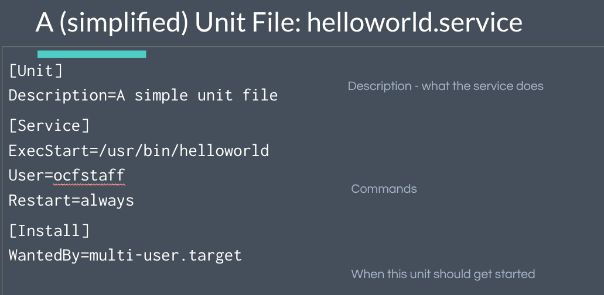

This post covers the fundamentals of services and processes in Linux as covered in Lecture 4 of the OCF Linux SysAdmin DeCal. The main goal is to help you become a more productive Linux user, not a kernel hacker.

---

## Understanding Processes

A process is a single instance of a running program. Processes are isolated from one another, each having its own memory and threads.

### Processes vs. Threads

A process has one or more threads.

Processes have their own data and code, must use pipes, files, etc. to communicate with one another. Threads share the same process but have different system states (“multithreaded process”)

### What Defines a Process?

Every process has several key identifiers and components:

- **PID:** A unique Process ID.
- **PPID:** The Parent's Process ID.
- **UID:** The ID of the user running the process.
- **Executable:** The program that the process is running.
- **Args:** The arguments (command line) of the process (and more...)

All processes are started by a parent process, with the exception of the very first one: the **init process**. This process is started at boot, is assigned PID 1, and serves as the ancestor for all other processes on the system.

### Process Creation: The `fork()` and `exec()` System Calls

A new process is created when an existing process calls `fork()`. This creates two processes, a parent and a child, which are nearly identical. The parent keeps its PID, while the child receives a new one. The child process can then optionally call `exec()` to replace its own program with a new one.

  

### How many henlo's get printed?

  

### The Process Lifecycle: Zombies and Orphans

When a child process terminates, it becomes a **zombie process**. Its metadata remains in the process table so its parent can read its exit status. The parent is responsible for "reaping" the zombie by calling the `wait()` system call. If a long-running parent process fails to do this, it can cause a resource leak as zombies accumulate.

If a parent process exits before its child, the child becomes an **orphan process**. Orphaned processes are immediately adopted by the init process (PID 1), which automatically reaps them when they exit, preventing them from becoming permanent zombies.

  

### Communication

#### Inter-Process Communication

- Exit codes
- Signals (e.g. SIGTERM, SIGKILL, SIGINT)
- Pipes (STDIN, STDOUT, STDERR)
- Sockets (UNIX socket, IP socket)
- Message Bus (e.g. dbus on Linux)
- and many more...

#### Process Signals

- SIGTERM: tell a process to exit now
- SIGKILL: terminate process immediately
- SIGINT: interrupt, when you press Ctrl+C
- SIGHUP: the user closes the terminal window
- SIGWINCH: terminal window resized
- SIGSTOP / SIGCONT: stop/resume

### Job Control in the Shell

Job control allows you to manage processes running in your shell. A **foreground process** is one attached to your shell, like an open editor or a script you're running. A **background process** runs without user interaction and does not block the terminal.

You can manage these jobs with a few key commands:

- **Ctrl+Z**: Suspends the currently running foreground process by sending it a `SIGTSTP` signal.
- **`jobs`**: Lists the current jobs (suspended or in the background).
- **`fg %jobid`**: Brings a suspended or background job to the foreground.
- **`bg %jobid`**: Resumes a suspended job in the background.
- **`command &`**: Starts a command directly in the background.

---

## Services and Daemons

A service is a special type of process known as a **daemon**. A daemon is a non-interactive background process designed to run for long periods. They are crucial for tasks like serving web pages (`nginx`), handling remote logins (`sshd`), or logging system events (`rsyslogd`).

---

## Managing Services with systemd

On modern Linux systems, services are managed by an init system, most commonly **systemd**. The primary tool for interacting with systemd is the `systemctl` command.

### Systemd Unit Files

Service behavior defined by systemd unit files How should this service start up? How should it respond to various systemctl management commands?

### Essential `systemctl` Commands

You can control any service managed by systemd with these commands:

- `systemctl status [name]`: Check the detailed status of a service.
- `systemctl start [name]`: Starts a service.
- `systemctl stop [name]`: Stops a service.
- `systemctl restart [name]`: Restarts a service.
- `systemctl enable [name]`: Sets a service to start automatically on boot.
- `systemctl disable [name]`: Prevents a service from starting on boot.
- `systemctl reload [name]`: Reload a service’s configuration.
